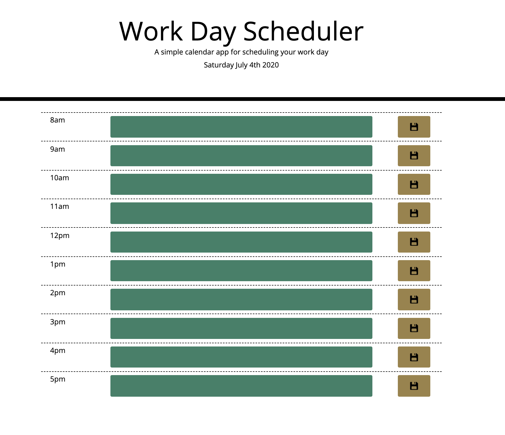

# Work Day Scheduler

## Purpose
A daily work schedule that organizes and tracks daily events. The schedule displays the current day at the top of the page. When the user scrolls down, they are presented with time blocks for standard business hours. When the user views the time blocks for that day, each time block is color-coded to indicate if the time is past, present or future. When the user enters an event and clicks save, the task is saved to local storage. When the page is refreshed the saved events persist. 

## Built With
* HTML
* CSS
* Bootstrap
* Moment.js
* jQuery
* JavaScript

## Website
https://mallynnk.github.io/daily-schedule/

## Screenshot
 

## Contribution
Mallory Korpics

